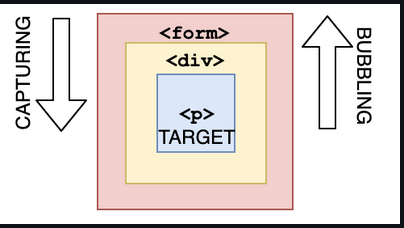

## Questions on events

#### Q1:What are the three phases of event propagation?

- A: Target > Capturing > Bubbling
- B: Bubbling > Target > Capturing
- C: Target > Bubbling > Capturing
- D: Capturing > Target > Bubbling

**Answer**:

Answer: D

During the **capturing** phase, the event goes through the ancestor elements down to the target element. It then reaches the **target** element, and **bubbling** begins.



#### Q2What is the event.target when clicking the button?

```html
<div onclick="console.log('first div')">
  <div onclick="console.log('second div')">
    <button onclick="console.log('button')">
      Click!
    </button>
  </div>
</div>
```

- A: Outer `div`
- B: Inner `div`
- C: `button`
- D: An array of all nested elements.

**Answer**:

Answer: C

The deepest nested element that caused the event is the target of the event. You can stop bubbling by `event.stopPropagation`

#### Q3:When you click the paragraph, what's the logged output?

```html
<div onclick="console.log('div')">
  <p onclick="console.log('p')">
    Click here!
  </p>
</div>
```

- A: `p` `div`
- B: `div` `p`
- C: `p`
- D: `div`

**Answer**:

Answer: A

If we click `p`, we see two logs: `p` and `div`. During event propagation, there are 3 phases: capturing, targeting, and bubbling. By default, event handlers are executed in the bubbling phase (unless you set `useCapture` to `true`). It goes from the deepest nested element outwards.