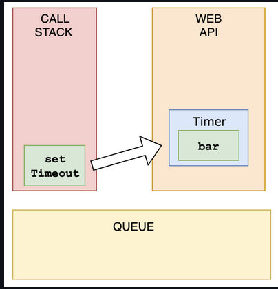
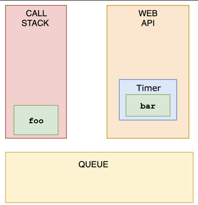
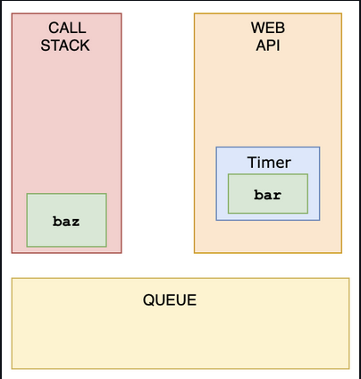
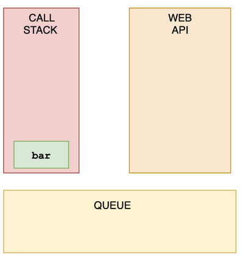

## Questions on Asynchronous Javascript

###### What's the output?

```js
const foo = () => console.log('First');
const bar = () => setTimeout(() => console.log('Second'));
const baz = () => console.log('Third');

bar();
foo();
baz();
```

- A: `First` `Second` `Third`
- B: `First` `Third` `Second`
- C: `Second` `First` `Third`
- D: `Second` `Third` `First`

**Answer**:

#### Answer: B

We have a `setTimeout` function and invoked it first. Yet, it was logged last.

This is because in browsers, we don't just have the runtime engine, we also have something called a `WebAPI`. The `WebAPI` gives us the `setTimeout` function to start with, and for example the DOM.

After the *callback* is pushed to the WebAPI, the `setTimeout` function itself (but not the callback!) is popped off the stack.



Now, `foo` gets invoked, and `"First"` is being logged.



`foo` is popped off the stack, and `baz` gets invoked. `"Third"` gets logged.



The WebAPI can't just add stuff to the stack whenever it's ready.  Instead, it pushes the callback function to something called the *queue*.


This is where an event loop starts to work. An **event loop** looks at the stack and task queue. If the stack is empty, it takes the first thing on the queue and pushes it onto the stack.



`bar` gets invoked, `"Second"` gets logged, and it's popped off the stack.


###### What does the `setInterval` method return in the browser?

```js
setInterval(() => console.log('Hi'), 1000);
```

- A: a unique id
- B: the amount of milliseconds specified
- C: the passed function
- D: `undefined`

**Answer**:

Answer: A

It returns a unique id. This id can be used to clear that interval with the `clearInterval()` function.


###### What does this return?

```js
const firstPromise = new Promise((res, rej) => {
  setTimeout(res, 500, 'one');
});

const secondPromise = new Promise((res, rej) => {
  setTimeout(res, 100, 'two');
});

Promise.race([firstPromise, secondPromise]).then(res => console.log(res));
```

- A: `"one"`
- B: `"two"`
- C: `"two" "one"`
- D: `"one" "two"`

**Answer**:

Answer: B

When we pass multiple promises to the `Promise.race` method, it resolves/rejects the *first* promise that resolves/rejects. To the `setTimeout` method, we pass a timer: 500ms for the first promise (`firstPromise`), and 100ms for the second promise (`secondPromise`). This means that the `secondPromise` resolves first with the value of `'two'`. `res` now holds the value of `'two'`, which gets logged.


###### What's the output?

```js
async function getData() {
  return await Promise.resolve('I made it!');
}

const data = getData();
console.log(data);
```

- A: `"I made it!"`
- B: `Promise {<resolved>: "I made it!"}`
- C: `Promise {<pending>}`
- D: `undefined`

**Answer**:

Answer: C

An async function always returns a promise. The `await` still has to wait for the promise to resolve: a pending promise gets returned when we call `getData()` in order to set `data` equal to it.

If we wanted to get access to the resolved value `"I made it"`, we could have used the `.then()` method on `data`:

`data.then(res => console.log(res))`

This would've logged `"I made it!"`


###### What kind of information would get logged?

```js
fetch('https://www.website.com/api/user/1')
  .then(res => res.json())
  .then(res => console.log(res));
```

- A: The result of the `fetch` method.
- B: The result of the second invocation of the `fetch` method.
- C: The result of the callback in the previous `.then()`.
- D: It would always be undefined.

**Answer**:

Answer: C

The value of `res` in the second `.then` is equal to the returned value of the previous `.then`. You can keep chaining `.then`s like this, where the value is passed to the next handler.