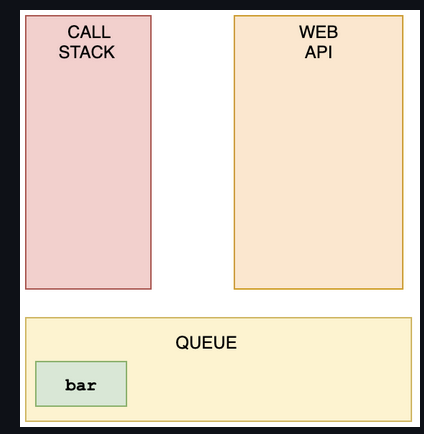

## Questions on Asynchronous Javascript

###### What's the output?

```js
const foo = () => console.log('First');
const bar = () => setTimeout(() => console.log('Second'));
const baz = () => console.log('Third');

bar();
foo();
baz();
```

- A: `First` `Second` `Third`
- B: `First` `Third` `Second`
- C: `Second` `First` `Third`
- D: `Second` `Third` `First`

**Answer**:

#### Answer: B

We have a `setTimeout` function and invoked it first. Yet, it was logged last.

This is because in browsers, we don't just have the runtime engine, we also have something called a `WebAPI`. The `WebAPI` gives us the `setTimeout` function to start with, and for example the DOM.

After the *callback* is pushed to the WebAPI, the `setTimeout` function itself (but not the callback!) is popped off the stack.


Now, `foo` gets invoked, and `"First"` is being logged.


`foo` is popped off the stack, and `baz` gets invoked. `"Third"` gets logged.


The WebAPI can't just add stuff to the stack whenever it's ready.  Instead, it pushes the callback function to something called the *queue*.



This is where an event loop starts to work. An **event loop** looks at the stack and task queue. If the stack is empty, it takes the first thing on the queue and pushes it onto the stack.


`bar` gets invoked, `"Second"` gets logged, and it's popped off the stack.


###### What does the `setInterval` method return in the browser?

```js
setInterval(() => console.log('Hi'), 1000);
```

- A: a unique id
- B: the amount of milliseconds specified
- C: the passed function
- D: `undefined`

**Answer**:

Answer: A

It returns a unique id. This id can be used to clear that interval with the `clearInterval()` function.


###### What does this return?

```js
const firstPromise = new Promise((res, rej) => {
  setTimeout(res, 500, 'one');
});

const secondPromise = new Promise((res, rej) => {
  setTimeout(res, 100, 'two');
});

Promise.race([firstPromise, secondPromise]).then(res => console.log(res));
```

- A: `"one"`
- B: `"two"`
- C: `"two" "one"`
- D: `"one" "two"`

**Answer**:

Answer: B

When we pass multiple promises to the `Promise.race` method, it resolves/rejects the *first* promise that resolves/rejects. To the `setTimeout` method, we pass a timer: 500ms for the first promise (`firstPromise`), and 100ms for the second promise (`secondPromise`). This means that the `secondPromise` resolves first with the value of `'two'`. `res` now holds the value of `'two'`, which gets logged.