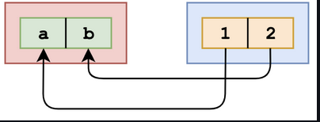

## Questions on destructuring

###### What's the output?

```js
const numbers = [1, 2, 3, 4, 5];
const [y] = numbers;

console.log(y);
```

- A: `[[1, 2, 3, 4, 5]]`
- B: `[1, 2, 3, 4, 5]`
- C: `1`
- D: `[1]`

**Answer**:

We can unpack values from arrays or properties from objects through destructuring. For example:

```js
[a, b] = [1, 2];
```

​    

The value of `a` is now `1`, and the value of `b` is now `2`. What we actually did in the question, is:

```js
[y] = [1, 2, 3, 4, 5];
```


This means that the value of `y` is equal to the first value in the array, which is the number `1`. When we log `y`, `1` is returned.


###### What's the output?

```js
const { firstName: myName } = { firstName: 'Lydia' };

console.log(firstName);
```

- A: `"Lydia"`
- B: `"myName"`
- C: `undefined`
- D: `ReferenceError`

**Answer**:

Answer: D

By using [destructuring assignment](https://developer.mozilla.org/en-US/docs/Web/JavaScript/Reference/Operators/Destructuring_assignment) syntax we can unpack values from arrays, or properties from objects, into distinct variables:

```js
const { firstName } = { firstName: 'Lydia' };
// ES5 version:
// var firstName = { firstName: 'Lydia' }.firstName;

console.log(firstName); // "Lydia"
```

 Also, a property can be unpacked from an object and assigned to a variable with a different name than the object property:

```js
const { firstName: myName } = { firstName: 'Lydia' };
// ES5 version:
// var myName = { firstName: 'Lydia' }.firstName;

console.log(myName); // "Lydia"
console.log(firstName); // Uncaught ReferenceError: firstName is not defined
```

​    Therefore, `firstName` does not exist as a variable, thus attempting to access its value will raise a `ReferenceError`.

**Note:** Be aware of the `global scope` properties:

```js
const { name: myName } = { name: 'Lydia' };

console.log(myName); // "lydia"
console.log(name); // "" ----- Browser e.g. Chrome
console.log(name); // ReferenceError: name is not defined  ----- NodeJS
```

​    Whenever Javascript is unable to find a variable within the *current scope*, it climbs up the [Scope chain](https://github.com/getify/You-Dont-Know-JS/blob/2nd-ed/scope-closures/ch3.md) and searches for it and if it reaches the top-level scope, aka **Global scope**, and still doesn't find it, it will throw a `ReferenceError`.

- In **Browsers** such as *Chrome*, `name` is a *deprecated global scope property*. In this example, the code is running inside *global scope* and there is no user-defined local variable for `name`, therefore it searches the predefined *variables/properties* in the global scope which is in the case of browsers, it searches through `window` object and it will extract the [window.name](https://developer.mozilla.org/en-US/docs/Web/API/Window/name) value which is equal to an **empty string**.
- In **NodeJS**, there is no such property on the `global` object, thus attempting to access a non-existent variable will raise a [ReferenceError](https://developer.mozilla.org/en-US/docs/Web/JavaScript/Reference/Errors/Not_defined).


###### What's the output?

```js
const getList = ([x, ...y]) => [x, y]
const getUser = user => { name: user.name, age: user.age }

const list = [1, 2, 3, 4]
const user = { name: "Lydia", age: 21 }

console.log(getList(list))
console.log(getUser(user))
```

- A: `[1, [2, 3, 4]]` and `SyntaxError`
- B: `[1, [2, 3, 4]]` and `{ name: "Lydia", age: 21 }`
- C: `[1, 2, 3, 4]` and `{ name: "Lydia", age: 21 }`
- D: `Error` and `{ name: "Lydia", age: 21 }`

**Answer**:

#### Answer: A


The `getList` function receives an array as its argument. Between the parentheses of the `getList` function, we destructure this array right away. You could see this as:

`[x, ...y] = [1, 2, 3, 4]`

With the rest parameter `...y`, we put all "remaining" arguments in an array. The remaining arguments are `2`, `3` and `4` in this case. The value of `y` is an array, containing all the rest parameters. The value of `x` is equal to `1` in this case, so when we log `[x, y]`, `[1, [2, 3, 4]]` gets logged.

The `getUser` function receives an object. With arrow functions, we don't *have* to write curly brackets if we just return one value. However, if you want to instantly return an *object* from an arrow function, you have to write it between parentheses,  otherwise everything between the two braces will be interpreted as a  block statement. In this case the code between the braces is not a valid JavaScript code, so a `SyntaxError` gets thrown.

The following function would have returned an object:

`const getUser = user => ({ name: user.name, age: user.age })`


###### What's the output?

```js
const spookyItems = ['👻', '🎃', '🕸'];
({ item: spookyItems[3] } = { item: '💀' });

console.log(spookyItems);
```

- A: `["👻", "🎃", "🕸"]`
- B: `["👻", "🎃", "🕸", "💀"]`
- C: `["👻", "🎃", "🕸", { item: "💀" }]`
- D: `["👻", "🎃", "🕸", "[object Object]"]`

**Answer**:

Answer: B

By destructuring objects, we can unpack values from the  right-hand object, and assign the unpacked value to the value of the  same property name on the left-hand object. In this case, we're  assigning the value "💀" to `spookyItems[3]`. This means that we're modifying the `spookyItems` array, we're adding the "💀" to it. When logging `spookyItems`, `["👻", "🎃", "🕸", "💀"]` gets logged.