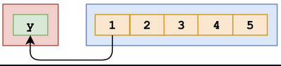

## Questions on destructuring

###### What's the output?

```js
const numbers = [1, 2, 3, 4, 5];
const [y] = numbers;

console.log(y);
```

- A: `[[1, 2, 3, 4, 5]]`
- B: `[1, 2, 3, 4, 5]`
- C: `1`
- D: `[1]`

**Answer**:

We can unpack values from arrays or properties from objects through destructuring. For example:

```js
[a, b] = [1, 2];
```

​    

The value of `a` is now `1`, and the value of `b` is now `2`. What we actually did in the question, is:

```js
[y] = [1, 2, 3, 4, 5];
```



This means that the value of `y` is equal to the first value in the array, which is the number `1`. When we log `y`, `1` is returned.