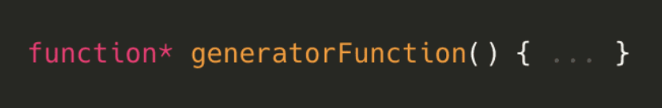
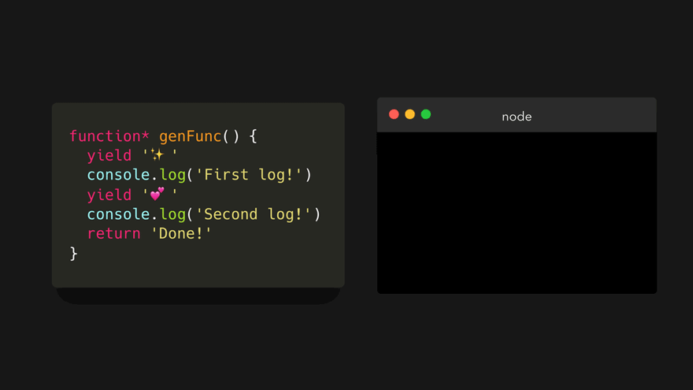
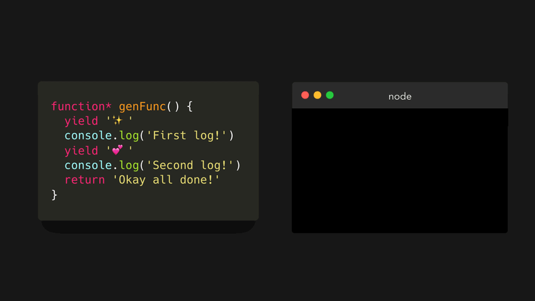
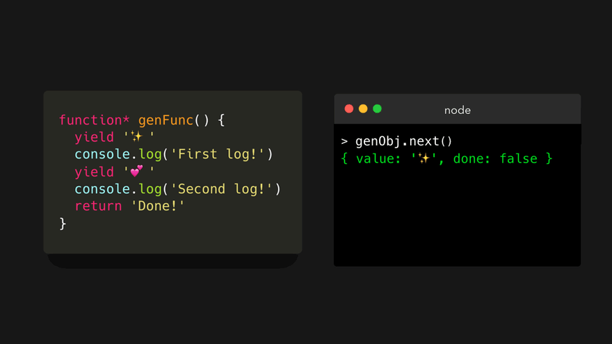

## Theory about generator functions

Normal functions follow something called a **run-to-completion** model: when we invoke a function, it will always run until it completes , generator functions  don't follow the **run-to-completion** model! 


We create a generator function by writing an asterisk `*` after the `function` keyword.



Generator functions actually work in a completely different way compared to regular functions:

- Invoking a generator function returns a **generator object**, which is an iterator.
- We can use the `yield` keyword in a generator function to "pause" the execution. 

With generator functions, we can write something like this (`genFunc` is short for `generatorFunction`):

```js
function* genFunc() {

  yield "✨";

  console.log("First log!");

  yield "💞";

  console.log("Second log!");

  return "Done!";

}
```

The execution of the generator gets "paused" when it encounters a `yield` keyword. The next time we run the function,  it remembers where it previously paused, and runs from there on! 

The generator object contains a `next` method (on the  prototype chain). This method is what we'll use to iterate the generator object. 



when we invoke the `next` method on the `genObj` generator object! 

The generator ran until it encountered the first `yield` keyword, which happened to be on the first line! It *yielded* an object containing a `value` property, and a `done` property.

{ value: ... , done: ... }

The `value` property is equal to the value that we yielded.
 The `done` property is a boolean value, which is only set to `true` once the generator function **returned** a value (not yielded! ). 



Let's invoke the `next` method again! . First, we logged the string `First log!` to the console. This is neither a `yield` nor `return` keyword, so it continues! Then, it encountered a `yield` keyword with the value `'💕'`. An object gets *yielded* with the `value` property of `'💕'` and a `done` property. The value of the `done` property is `false`, since we haven't *returned* from the generator yet. 

