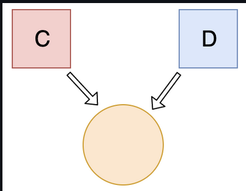
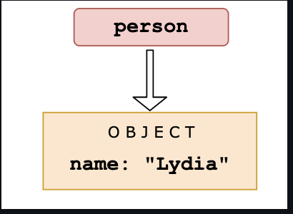
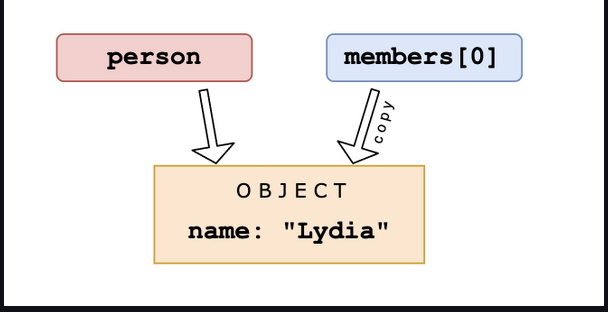
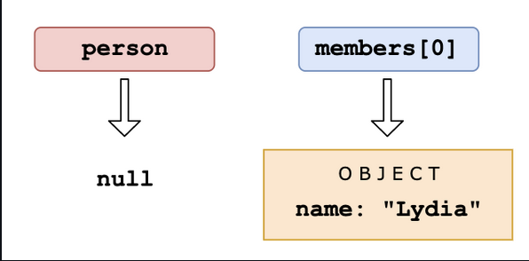
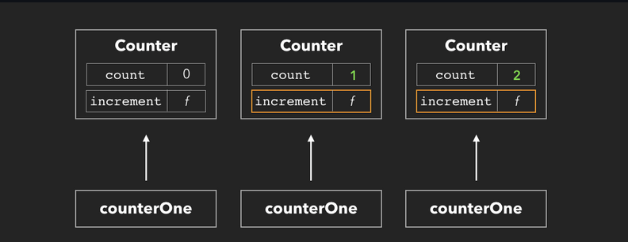
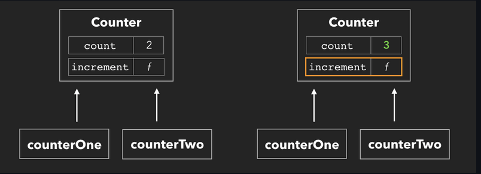

## Questions on objects 

Q:Which one is true?

```js
const bird = {
  size: 'small',
};

const mouse = {
  name: 'Mickey',
  small: true,
};
```

- A: `mouse.bird.size` is not valid
- B: `mouse[bird.size]` is not valid
- C: `mouse[bird["size"]]` is not valid
- D: All of them are valid

**Answer**:

Answer: A

In JavaScript, all object keys are strings (unless it's a Symbol). Even though we might not *type* them as strings, they are always converted into strings under the hood.

JavaScript interprets (or unboxes) statements. When we use bracket notation, it sees the first opening bracket `[` and keeps going until it finds the closing bracket `]`. Only then, it will evaluate the statement.

mouse[bird.size]`: First it evaluates `bird.size`, which is `"small"`. `mouse["small"]` returns `true

However, with dot notation, this doesn't happen. `mouse` does not have a key called `bird`, which means that `mouse.bird` is `undefined`. Then, we ask for the `size` using dot notation: `mouse.bird.size`. Since `mouse.bird` is `undefined`, we're actually asking `undefined.size`. This isn't valid, and will throw an error similar to `Cannot read property "size" of undefined`.


###### Q:What's the output?

```js
let c = { greeting: 'Hey!' };
let d;

d = c;
c.greeting = 'Hello';
console.log(d.greeting);
```

- A: `Hello`
- B: `Hey!`
- C: `undefined`
- D: `ReferenceError`
- E: `TypeError`

**Answer**:

Answer: A

In JavaScript, all objects interact by *reference* when setting them equal to each other.

First, variable `c` holds a value to an object. Later, we assign `d` with the same reference that `c` has to the object.



When you change one object, you change all of them.


######  What's the output?

```js
function checkAge(data) {
  if (data === { age: 18 }) {
    console.log('You are an adult!');
  } else if (data == { age: 18 }) {
    console.log('You are still an adult.');
  } else {
    console.log(`Hmm.. You don't have an age I guess`);
  }
}

checkAge({ age: 18 });
```

- A: `You are an adult!`
- B: `You are still an adult.`
- C: `Hmm.. You don't have an age I guess`

**Answer**:

Answer: C

When testing equality, primitives are compared by their *value*, while objects are compared by their *reference*. JavaScript checks if the objects have a reference to the same location in memory.

The two objects that we are comparing don't have that: the object we passed as a parameter refers to a different location in  memory than the object we used in order to check equality.

This is why both `{ age: 18 } === { age: 18 }` and `{ age: 18 } == { age: 18 }` return `false`.


###### What's the output?

```js
const obj = { 1: 'a', 2: 'b', 3: 'c' };
const set = new Set([1, 2, 3, 4, 5]);

obj.hasOwnProperty('1');
obj.hasOwnProperty(1);
set.has('1');
set.has(1);
```

- A: `false` `true` `false` `true`
- B: `false` `true` `true` `true`
- C: `true` `true` `false` `true`
- D: `true` `true` `true` `true`

**Answer**:

Answer: C

All object keys (excluding Symbols) are strings under the hood, even if you don't type it yourself as a string. This is why `obj.hasOwnProperty('1')` also returns true.

It doesn't work that way for a set. There is no `'1'` in our set: `set.has('1')` returns `false`. It has the numeric type `1`, `set.has(1)` returns `true`.


###### What's the output?

```js
const obj = { a: 'one', b: 'two', a: 'three' };
console.log(obj);
```

- A: `{ a: "one", b: "two" }`
- B: `{ b: "two", a: "three" }`
- C: `{ a: "three", b: "two" }`
- D: `SyntaxError`

**Answer**:

Answer: C

If you have two keys with the same name, the key will be  replaced. It will still be in its first position, but with the last  specified value.


###### What's the output?

```js
const a = {};
const b = { key: 'b' };
const c = { key: 'c' };

a[b] = 123;
a[c] = 456;

console.log(a[b]);
```

- A: `123`
- B: `456`
- C: `undefined`
- D: `ReferenceError`

**Answer**:

Answer: B

Object keys are automatically converted into strings. We are trying to set an object as a key to object `a`, with the value of `123`.

However, when we stringify an object, it becomes `"[object Object]"`. So what we are saying here, is that `a["[object Object]"] = 123`. Then, we can try to do the same again. `c` is another object that we are implicitly stringifying. So then, `a["[object Object]"] = 456`.

Then, we log `a[b]`, which is actually `a["[object Object]"]`. We just set that to `456`, so it returns `456`.


###### What's the output?

```js
let person = { name: 'Lydia' };
const members = [person];
person = null;

console.log(members);
```

- A: `null`
- B: `[null]`
- C: `[{}]`
- D: `[{ name: "Lydia" }]`

**Answer**:

Answer: D

First, we declare a variable `person` with the value of an object that has a `name` property.



Then, we declare a variable called `members`. We set the first element of that array equal to the value of the `person` variable. Objects interact by *reference* when setting them equal to each other. When you assign a reference from one variable to another, you make a *copy* of that reference. (note that they don't have the *same* reference!)



Then, we set the variable `person` equal to `null`.



We are only modifying the value of the `person` variable, and not the first element in the array, since that element has a different  (copied) reference to the object. The first element in `members` still holds its reference to the original object. When we log the `members` array, the first element still holds the value of the object, which gets logged.


###### What's the output?

```js
const person = {
  name: 'Lydia',
  age: 21,
};

for (const item in person) {
  console.log(item);
}
```

- A: `{ name: "Lydia" }, { age: 21 }`
- B: `"name", "age"`
- C: `"Lydia", 21`
- D: `["name", "Lydia"], ["age", 21]`

**Answer**:

Answer: B

With a `for-in` loop, we can iterate through object keys, in this case `name` and `age`. Under the hood, object keys are strings (if they're not a Symbol). On every loop, we set the value of `item` equal to the current key it’s iterating over. First, `item` is equal to `name`, and gets logged. Then, `item` is equal to `age`, which gets logged.


###### What's the output?

```js
const person = { name: 'Lydia' };

Object.defineProperty(person, 'age', { value: 21 });

console.log(person);
console.log(Object.keys(person));
```

- A: `{ name: "Lydia", age: 21 }`, `["name", "age"]`
- B: `{ name: "Lydia", age: 21 }`, `["name"]`
- C: `{ name: "Lydia"}`, `["name", "age"]`
- D: `{ name: "Lydia"}`, `["age"]`

**Answer**:

Answer: B

With the `defineProperty` method, we can add new properties to an object, or modify existing ones. When we add a property to an object using the `defineProperty` method, they are by default *not enumerable*. The `Object.keys` method returns all *enumerable* property names from an object, in this case only `"name"`.

Properties added using the `defineProperty` method are immutable by default. You can override this behavior using the `writable`, `configurable` and `enumerable` properties. This way, the `defineProperty` method gives you a lot more control over the properties you're adding to an object.


###### What's the output?

```js
const settings = {
  username: 'lydiahallie',
  level: 19,
  health: 90,
};

const data = JSON.stringify(settings, ['level', 'health']);
console.log(data);
```

- A: `"{"level":19, "health":90}"`
- B: `"{"username": "lydiahallie"}"`
- C: `"["level", "health"]"`
- D: `"{"username": "lydiahallie", "level":19, "health":90}"`

**Answer**:

Answer: A

The second argument of `JSON.stringify` is the *replacer*. The replacer can either be a function or an array, and lets you control what and how the values should be stringified.

If the replacer is an *array*, only the property  names included in the array will be added to the JSON string. In this  case, only the properties with the names `"level"` and `"health"` are included, `"username"` is excluded. `data` is now equal to `"{"level":19, "health":90}"`.

If the replacer is a *function*, this function gets called on every property in the object you're stringifying. The value  returned from this function will be the value of the property when it's  added to the JSON string. If the value is `undefined`, this property is excluded from the JSON string.


###### What's the output?

```js
const box = { x: 10, y: 20 };

Object.freeze(box);

const shape = box;
shape.x = 100;

console.log(shape);
```

- A: `{ x: 100, y: 20 }`
- B: `{ x: 10, y: 20 }`
- C: `{ x: 100 }`
- D: `ReferenceError`

**Answer**:

Answer: B

`Object.freeze` makes it impossible to add, remove, or modify properties of an object (unless the property's value is another object).

When we create the variable `shape` and set it equal to the frozen object `box`, `shape` also refers to a frozen object. You can check whether an object is frozen by using `Object.isFrozen`. In this case, `Object.isFrozen(shape)` would return true, since the variable `shape` has a reference to a frozen object.

Since `shape` is frozen, and since the value of `x` is not an object, we cannot modify the property `x`. `x` is still equal to `10`, and `{ x: 10, y: 20 }` gets logged.


###### What is the output?

```js
const person = {
  name: 'Lydia',
  age: 21,
};

let city = person.city;
city = 'Amsterdam';

console.log(person);
```

- A: `{ name: "Lydia", age: 21 }`
- B: `{ name: "Lydia", age: 21, city: "Amsterdam" }`
- C: `{ name: "Lydia", age: 21, city: undefined }`
- D: `"Amsterdam"`

**Answer**:

Answer: A

We set the variable `city` equal to the value of the property called `city` on the `person` object. There is no property on this object called `city`, so the variable `city` has the value of `undefined`.

Note that we are *not* referencing the `person` object itself! We simply set the variable `city` equal to the current value of the `city` property on the `person` object.

Then, we set `city` equal to the string `"Amsterdam"`. This doesn't change the person object: there is no reference to that object.

When logging the `person` object, the unmodified object gets returned.


###### What's the output?

```js
class Person {
  constructor(name) {
    this.name = name;
  }
}

const member = new Person('John');
console.log(typeof member);
```

- A: `"class"`
- B: `"function"`
- C: `"object"`
- D: `"string"`

**Answer**:

Answer: C

Classes are syntactical sugar for function constructors. The equivalent of the `Person` class as a function constructor would be:

```js
function Person(name) {
  this.name = name;
}
```

​    Calling a function constructor with `new` results in the creation of an instance of `Person`, `typeof` keyword returns `"object"` for an instance. `typeof member` returns `"object"`.


###### What's the output?

```js
const person = {
  name: 'Lydia',
  age: 21,
};

for (const [x, y] of Object.entries(person)) {
  console.log(x, y);
}
```

- A: `name` `Lydia` and `age` `21`
- B: `["name", "Lydia"]` and `["age", 21]`
- C: `["name", "age"]` and `undefined`
- D: `Error`

**Answer**:

Answer: A


`Object.entries(person)` returns an array of nested arrays, containing the keys and objects:

`[ [ 'name', 'Lydia' ], [ 'age', 21 ] ]`

Using the `for-of` loop, we can iterate over  each element in the array, the subarrays in this case. We can  destructure the subarrays instantly in the for-of loop, using `const [x, y]`. `x` is equal to the first element in the subarray, `y` is equal to the second element in the subarray.

The first subarray is `[ "name", "Lydia" ]`, with `x` equal to `"name"`, and `y` equal to `"Lydia"`, which get logged. The second subarray is `[ "age", 21 ]`, with `x` equal to `"age"`, and `y` equal to `21`, which get logged.


###### What's the output?

```js
const info = {
  [Symbol('a')]: 'b',
};

console.log(info);
console.log(Object.keys(info));    
```

- A: `{Symbol('a'): 'b'}` and `["{Symbol('a')"]`
- B: `{}` and `[]`
- C: `{ a: "b" }` and `["a"]`
- D: `{Symbol('a'): 'b'}` and `[]`

**Answer**:

Answer: D

A Symbol is not *enumerable*. The Object.keys method returns all *enumerable* key properties on an object. The Symbol won't be visible, and an empty  array is returned. When logging the entire object, all properties will  be visible, even non-enumerable ones.

This is one of the many qualities of a symbol: besides  representing an entirely unique value (which prevents accidental name  collision on objects, for example when working with 2 libraries that  want to add properties to the same object), you can also "hide"  properties on objects this way (although not entirely. You can still  access symbols using the `Object.getOwnPropertySymbols()` method).


###### What's its value?

```js
function compareMembers(person1, person2 = person) {
  if (person1 !== person2) {
    console.log('Not the same!');
  } else {
    console.log('They are the same!');
  }
}

const person = { name: 'Lydia' };

compareMembers(person);
```

- A: `Not the same!`
- B: `They are the same!`
- C: `ReferenceError`
- D: `SyntaxError`

**Answer**:

Answer: B

Objects are passed by reference. When we check objects for strict equality (`===`), we're comparing their references.

We set the default value for `person2` equal to the `person` object, and passed the `person` object as the value for `person1`.

This means that both values have a reference to the same spot in memory, thus they are equal.

The code block in the `else` statement gets run, and `They are the same!` gets logged.


###### What's its value?

```js
const colorConfig = {
  red: true,
  blue: false,
  green: true,
  black: true,
  yellow: false,
};

const colors = ['pink', 'red', 'blue'];

console.log(colorConfig.colors[1]);
```

- A: `true`
- B: `false`
- C: `undefined`
- D: `TypeError`

**Answer**:

Answer: D

In JavaScript, we have two ways to access properties on an object: bracket notation, or dot notation. In this example, we use dot  notation (`colorConfig.colors`) instead of bracket notation (`colorConfig["colors"]`).

With dot notation, JavaScript tries to find the property  on the object with that exact name. In this example, JavaScript tries to find a property called `colors` on the `colorConfig` object. There is no property called `colors`, so this returns `undefined`. Then, we try to access the value of the first element by using `[1]`. We cannot do this on a value that's `undefined`, so it throws a `TypeError`: `Cannot read property '1' of undefined`.

JavaScript interprets (or unboxes) statements. When we use bracket notation, it sees the first opening bracket `[` and keeps going until it finds the closing bracket `]`. Only then, it will evaluate the statement. If we would've used `colorConfig[colors[1]]`, it would have returned the value of the `red` property on the `colorConfig` object.


###### What's the output?

```js
const food = ['🍕', '🍫', '🥑', '🍔'];
const info = { favoriteFood: food[0] };

info.favoriteFood = '🍝';

console.log(food);
```

- A: `['🍕', '🍫', '🥑', '🍔']`
- B: `['🍝', '🍫', '🥑', '🍔']`
- C: `['🍝', '🍕', '🍫', '🥑', '🍔']`
- D: `ReferenceError`

**Answer**:

Answer: A

We set the value of the `favoriteFood` property on the `info` object equal to the string with the pizza emoji, `'🍕'`. A string is a primitive data type. In JavaScript, primitive data types don't interact by reference.

In JavaScript, primitive data types (everything that's not an object) interact by *value*. In this case, we set the value of the `favoriteFood` property on the `info` object equal to the value of the first element in the `food` array, the string with the pizza emoji in this case (`'🍕'`). A string is a primitive data type, and interact by value (see my [blogpost](https://www.theavocoder.com/complete-javascript/2018/12/21/by-value-vs-by-reference) if you're interested in learning more)

Then, we change the value of the `favoriteFood` property on the `info` object. The `food` array hasn't changed, since the value of `favoriteFood` was merely a *copy* of the value of the first element in the array, and doesn't have a reference to the same spot in memory as the element on `food[0]`. When we log food, it's still the original array, `['🍕', '🍫', '🥑', '🍔']`.


###### What does this method do?

```js
JSON.parse();
```

- A: Parses JSON to a JavaScript value
- B: Parses a JavaScript object to JSON
- C: Parses any JavaScript value to JSON
- D: Parses JSON to a JavaScript object only

**Answer**:

Answer: A

With the `JSON.parse()` method, we can parse JSON string to a JavaScript value.

```js
// Stringifying a number into valid JSON, then parsing the JSON string to a JavaScript value:
const jsonNumber = JSON.stringify(4); // '4'
JSON.parse(jsonNumber); // 4

// Stringifying an array value into valid JSON, then parsing the JSON string to a JavaScript value:
const jsonArray = JSON.stringify([1, 2, 3]); // '[1, 2, 3]'
JSON.parse(jsonArray); // [1, 2, 3]

// Stringifying an object  into valid JSON, then parsing the JSON string to a JavaScript value:
const jsonArray = JSON.stringify({ name: 'Lydia' }); // '{"name":"Lydia"}'
JSON.parse(jsonArray); // { name: 'Lydia' }
```


###### What will happen?

```js
let config = {
  alert: setInterval(() => {
    console.log('Alert!');
  }, 1000),
};

config = null;
```

- A: The `setInterval` callback won't be invoked
- B: The `setInterval` callback gets invoked once
- C: The `setInterval` callback will still be called every second
- D: We never invoked `config.alert()`, config is `null`

**Answer**:

Answer: C

Normally when we set objects equal to `null`, those objects get *garbage collected* as there is no reference anymore to that object. However, since the callback function within `setInterval` is an arrow function (thus bound to the `config` object), the callback function still holds a reference to the `config` object. As long as there is a reference, the object won't get garbage collected. Since this is an interval, setting `config` to `null` or `delete`-ing `config.alert` won't garbage-collect the interval, so the interval will still be called. It should be cleared with `clearInterval(config.alert)` to remove it from memory. Since it was not cleared, the `setInterval` callback function will still get invoked every 1000ms (1s).


###### What's the output?

```js
const person = {
  name: 'Lydia',
  age: 21,
};

const changeAge = (x = { ...person }) => (x.age += 1);
const changeAgeAndName = (x = { ...person }) => {
  x.age += 1;
  x.name = 'Sarah';
};

changeAge(person);
changeAgeAndName();

console.log(person);
```

- A: `{name: "Sarah", age: 22}`
- B: `{name: "Sarah", age: 23}`
- C: `{name: "Lydia", age: 22}`
- D: `{name: "Lydia", age: 23}`

**Answer**:

Answer: C

Both the `changeAge` and `changeAgeAndName` functions have a default parameter, namely a *newly* created object `{ ...person }`. This object has copies of all the key/values in the `person` object.

First, we invoke the `changeAge` function and pass the `person` object as its argument. This function increases the value of the `age` property by 1. `person` is now `{ name: "Lydia", age: 22 }`.

Then, we invoke the `changeAgeAndName` function, however we don't pass a parameter. Instead, the value of `x` is equal to a *new* object: `{ ...person }`. Since it's a new object, it doesn't affect the values of the properties on the `person` object. `person` is still equal to `{ name: "Lydia", age: 22 }`.


###### What's the output?

```js
const config = {
  languages: [],
  set language(lang) {
    return this.languages.push(lang);
  },
};

console.log(config.language);
```

- A: `function language(lang) { this.languages.push(lang }`
- B: `0`
- C: `[]`
- D: `undefined`

**Answer**:

Answer: D

The `language` method is a `setter`. Setters don't hold an actual value, their purpose is to *modify* properties. When calling a `setter` method, `undefined` gets returned.


###### What's the output?

```js
const myFunc = ({ x, y, z }) => {
  console.log(x, y, z);
};

myFunc(1, 2, 3);
```

- A: `1` `2` `3`
- B: `{1: 1}` `{2: 2}` `{3: 3}`
- C: `{ 1: undefined }` `undefined` `undefined`
- D: `undefined` `undefined` `undefined`

**Answer**:

Answer: D

`myFunc` expects an object with properties `x`, `y` and `z` as its argument. Since we're only passing three separate numeric values (1, 2, 3) instead of one object with properties `x`, `y` and `z` ({x: 1, y: 2, z: 3}), `x`, `y` and `z` have their default value of `undefined`.


###### What's the output?

```js
class Counter {
  constructor() {
    this.count = 0;
  }

  increment() {
    this.count++;
  }
}

const counterOne = new Counter();
counterOne.increment();
counterOne.increment();

const counterTwo = counterOne;
counterTwo.increment();

console.log(counterOne.count); 
```

- A: `0`
- B: `1`
- C: `2`
- D: `3`

**Answer**:

Answer: D

`counterOne` is an instance of the `Counter` class. The counter class contains a `count` property on its constructor, and an `increment` method. First, we invoked the `increment` method twice by calling `counterOne.increment()`. Currently, `counterOne.count` is `2`.



Then, we create a new variable `counterTwo`, and set it equal to `counterOne`. Since objects interact by reference, we're just creating a new reference to the same spot in memory that `counterOne` points to. Since it has the same spot in memory, any changes made to the object that `counterTwo` has a reference to, also apply to `counterOne`. Currently, `counterTwo.count` is `2`.

We invoke `counterTwo.increment()`, which sets `count` to `3`. Then, we log the count on `counterOne`, which logs `3`.




###### What's the output?

```js
const handler = {
  set: () => console.log('Added a new property!'),
  get: () => console.log('Accessed a property!'),
};

const person = new Proxy({}, handler);

person.name = 'Lydia';
person.name;
```

- A: `Added a new property!`
- B: `Accessed a property!`
- C: `Added a new property!` `Accessed a property!`
- D: Nothing gets logged

**Answer**:

Answer: C

With a Proxy object, we can add custom behavior to an  object that we pass to it as the second argument. In this case, we pass  the `handler` object which contains two properties: `set` and `get`. `set` gets invoked whenever we *set* property values, and `get` gets invoked whenever we *get* (access) property values.

The first argument is an empty object `{}`, which is the value of `person`. To this object, the custom behavior specified in the `handler` object gets added. If we add a property to the `person` object, `set` will get invoked. If we access a property on the `person` object, `get` gets invoked.

First, we added a new property `name` to the proxy object (`person.name = "Lydia"`). `set` gets invoked, and logs `"Added a new property!"`.

Then, we access a property value on the proxy object, and the `get` property on the handler object is invoked. `"Accessed a property!"` gets logged.


###### Which of the following will modify the `person` object?

```js
const person = { name: 'Lydia Hallie' };

Object.seal(person);
```

- A: `person.name = "Evan Bacon"`
- B: `person.age = 21`
- C: `delete person.name`
- D: `Object.assign(person, { age: 21 })`

**Answer**:

Answer: A

With `Object.seal` we can prevent new properties from being *added*, or existing properties to be *removed*.

However, you can still modify the value of existing properties.


###### Which of the following will modify the `person` object?

```js
const person = {
  name: 'Lydia Hallie',
  address: {
    street: '100 Main St',
  },
};

Object.freeze(person);
```

- A: `person.name = "Evan Bacon"`
- B: `delete person.address`
- C: `person.address.street = "101 Main St"`
- D: `person.pet = { name: "Mara" }`

**Answer**:

Answer: C

The `Object.freeze` method *freezes* an object. No properties can be added, modified, or removed.

However, it only *shallowly* freezes the object, meaning that only *direct* properties on the object are frozen. If the property is another object, like `address` in this case, the properties on that object aren't frozen, and can be modified.


###### What's the output?

```js
const user = {
	email: "e@mail.com",
	password: "12345"
}

const updateUser = ({ email, password }) => {
	if (email) {
		Object.assign(user, { email })
	}

	if (password) {
		user.password = password
	}

	return user
}

const updatedUser = updateUser({ email: "new@email.com" })

console.log(updatedUser === user)
```

- A: `false`
- B: `true`
- C: `TypeError`
- D: `ReferenceError`

**Answer**:

Answer: B

The `updateUser` function updates the values of the `email` and `password` properties on user, if their values are passed to the function, after which the function returns the `user` object. The returned value of the `updateUser` function is the `user` object, which means that the value of updatedUser is a reference to the same `user` object that `user` points to. `updatedUser === user` equals `true`.


###### What's the output?

```js
const animals = {};
let dog = { emoji: '🐶' }
let cat = { emoji: '🐈' }

animals[dog] = { ...dog, name: "Mara" }
animals[cat] = { ...cat, name: "Sara" }

console.log(animals[dog])
```

- A: `{ emoji: "🐶", name: "Mara" }`
- B: `{ emoji: "🐈", name: "Sara" }`
- C: `undefined`
- D: `ReferenceError`

**Answer**:

Answer: B

Object keys are converted to strings.

Since the value of  `dog` is an object,  `animals[dog]` actually means that we’re creating a new property called `"[object Object]"` equal to the new object. `animals["[object Object]"]` is now equal to `{ emoji: "🐶", name: "Mara"}`.

`cat` is also an object, which means that `animals[cat]` actually means that we’re overwriting the value of  `animals["[object Object]"]` with the new cat properties.

Logging `animals[dog]`, or actually `animals["[object Object]"]` since converting the `dog` object to a string results `"[object Object]"`, returns the `{ emoji: "🐈", name: "Sara" }`.


###### What should the value of `method` be to log `{ name: "Lydia", age: 22 }`?

```js
const keys = ["name", "age"]
const values = ["Lydia", 22]

const method = /* ?? */
Object[method](keys.map((_, i) => {
	return [keys[i], values[i]]
})) // { name: "Lydia", age: 22 }
```

- A: `entries`
- B: `values`
- C: `fromEntries`
- D: `forEach`

**Answer**:

Answer: C

The `fromEntries` method turns a 2d array into  an object. The first element in each subarray will be the key, and the  second element in each subarray will be the value. In this case, we’re  mapping over the `keys` array, which returns an array that  the first element is the item on the key array on the current index, and the second element is the item of the values array on the current  index.

This creates an array of subarrays containing the correct keys and values, which results in `{ name: "Lydia", age: 22 }`


###### What's the output?

```js
const createMember = ({ email, address = {}}) => {
	const validEmail = /.+\@.+\..+/.test(email)
	if (!validEmail) throw new Error("Valid email pls")

	return {
		email,
		address: address ? address : null
	}
}

const member = createMember({ email: "my@email.com" })
console.log(member)
```

- A: `{ email: "my@email.com", address: null }`
- B: `{ email: "my@email.com" }`
- C: `{ email: "my@email.com", address: {} }`
- D: `{ email: "my@email.com", address: undefined }`

**Answer**:

Answer: C

The default value of `address` is an empty object `{}`. When we set the variable `member` equal to the object returned by the `createMember` function, we didn't pass a value for the address, which means that the value of the address is the default empty object `{}`. An empty object is a truthy value, which means that the condition of the `address ? address : null` conditional returns `true`. The value of the address is the empty object `{}`.


**What will be the output**

```js
let a = { x: 1, y: 2 }
let b = a;
b.x = 3;
console.log(a);
console.log(b);
```

**Answer**:

- **Output** : { x: 3, y: 2 } { x: 3, y: 2 }
- **Reason** : 'a' and 'b' both are pointing to the same reference.

**What will be the output**

```js
console.log({} == {}); 
console.log({} === {});
```

**Answer**:

- **Output** : false, false
- **Reason** : When you compare objects using == or ===, it checks if they refer to the exact same object. So even if they are looking  same, they are pointing to different memory locations.

**What will be the output (shallow copy of an object)**

```js
const userDetails = {
  firstName: "Surbhi",
  lastName: "Dighe",
  age: 20,
  address: {
    city: "Hyderabad",
    country: "India",
  },
};

let cloneUserDetails = { ...userDetails };
//Updating original object
userDetails.age = 22;
userDetails.address.city = "Banglore";

console.log(cloneUserDetails.age); 
console.log(cloneUserDetails.address.city);
```

**Answer**:

- **Output** : 20, "Banglore"
- **Reason**  : cloneUserDetails is created by using the spread  syntax ({ ...userDetails }). This syntax creates a shallow copy of the  userDetails object, meaning that the top-level properties are copied,  but nested objects are still referenced.
- **case 1** : Although userDetails.age was changed to 22,  cloneUserDetails still holds the original value of 20. This is because  the spread syntax only creates a shallow copy, so the age property of  cloneUserDetails remains unchanged.
- **case 2** : The nested address object is still referenced by  cloneUserDetails, so when the city property of userDetails.address is  changed, it reflects in cloneUserDetails.address as well. Therefore, the output is "Banglore".


**What will be the output**

```js
const a = {x : 1};
const b = {x : 1};
console.log(a === b);
console.log(a.x === b.x)
```

**Answer**:

- **Output** : false, true
- **Reason for console.log(a === b)** : This compares whether a  and b refer to the exact same object in memory. They are two different  objects in memory, so the comparison evaluates to false
- **Reason for console.log(a.x === b.x)** : This compares the x  property of objects a and b. Since both a.x and b.x have the same value  i.e., 1, so the comparison evaluates to true.


**What will be the output**

```js
const arr = ["A","B","C","D","E"]
console.log(Object.keys(arr)); 
```

**Answer**:

- **Output** : [ '0', '1', '2', '3', '4' ]
- **Reason** : In JavaScript, arrays are a special type of object. Object.keys() on an array returns an array of strings representing the  indices of the array elements. 


#### Q2:What's the output?

```js
function getInfo(member, year) {
  member.name = 'Lydia';
  year = '1998';
}

const person = { name: 'Sarah' };
const birthYear = '1997';

getInfo(person, birthYear);

console.log(person, birthYear);
```

- A: `{ name: "Lydia" }, "1997"`
- B: `{ name: "Sarah" }, "1998"`
- C: `{ name: "Lydia" }, "1998"`
- D: `{ name: "Sarah" }, "1997"`

**Answer**:

Answer: A

Arguments are passed by *value*, unless their value is an object, then they're passed by *reference*. `birthYear` is passed by value, since it's a string, not an object. When we pass arguments by value, a *copy* of that value is created (see question 46).

The variable `birthYear` has a reference to the value `"1997"`. The argument `year` also has a reference to the value `"1997"`, but it's not the same value as `birthYear` has a reference to. When we update the value of `year` by setting `year` equal to `"1998"`, we are only updating the value of `year`. `birthYear` is still equal to `"1997"`.

The value of `person` is an object. The argument `member` has a (copied) reference to the *same* object. When we modify a property of the object `member` has a reference to, the value of `person` will also be modified, since they both have a reference to the same object. `person`'s `name` property is now equal to the value `"Lydia"`


#### Q2:What's the output?

```js
const value = { number: 10 };

const multiply = (x = { ...value }) => {
  console.log((x.number *= 2));
};

multiply();
multiply();
multiply(value);
multiply(value);
```

​    

- A: `20`, `40`, `80`, `160`
- B: `20`, `40`, `20`, `40`
- C: `20`, `20`, `20`, `40`
- D: `NaN`, `NaN`, `20`, `40`

**Answer**:

Answer: C

In ES6, we can initialize parameters with a default value. The value of the parameter will be the default value, if no other value has been passed to the function, or if the value of the parameter is `"undefined"`. In this case, we spread the properties of the `value` object into a new object, so `x` has the default value of `{ number: 10 }`.

The default argument is evaluated at *call time*! Every time we call the function, a *new* object is created. We invoke the `multiply` function the first two times without passing a value: `x` has the default value of `{ number: 10 }`. We then log the multiplied value of that number, which is `20`.

The third time we invoke multiply, we do pass an argument: the object called `value`. The `*=` operator is actually shorthand for `x.number = x.number * 2`: we modify the value of `x.number`, and log the multiplied value `20`.

The fourth time, we pass the `value` object again. `x.number` was previously modified to `20`, so `x.number *= 2` logs `40`.
